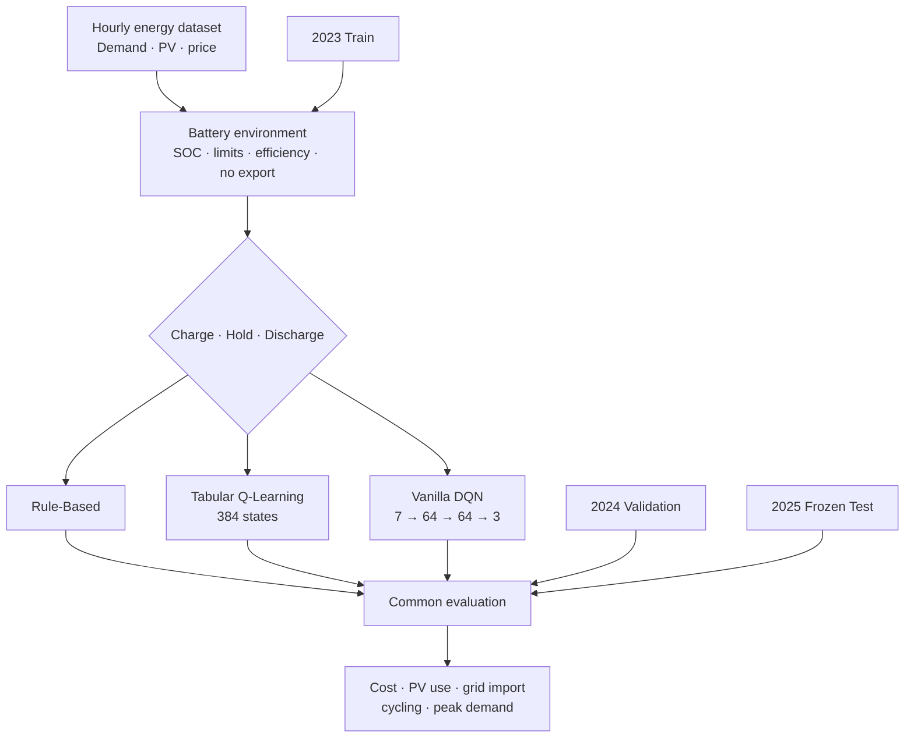
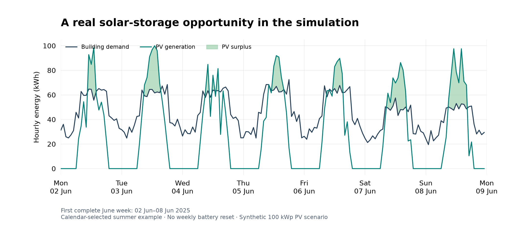
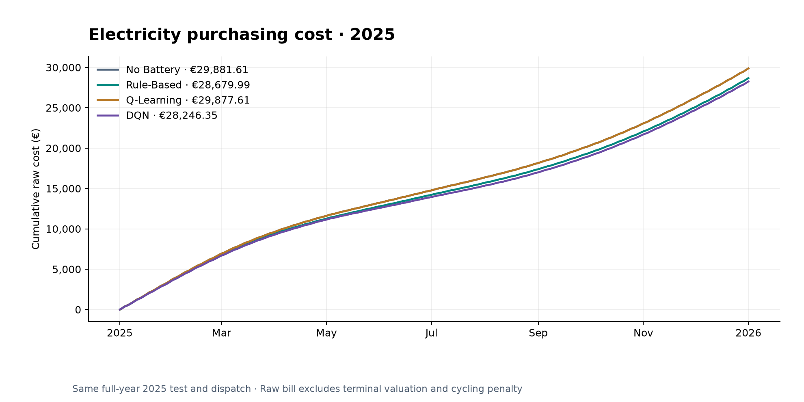
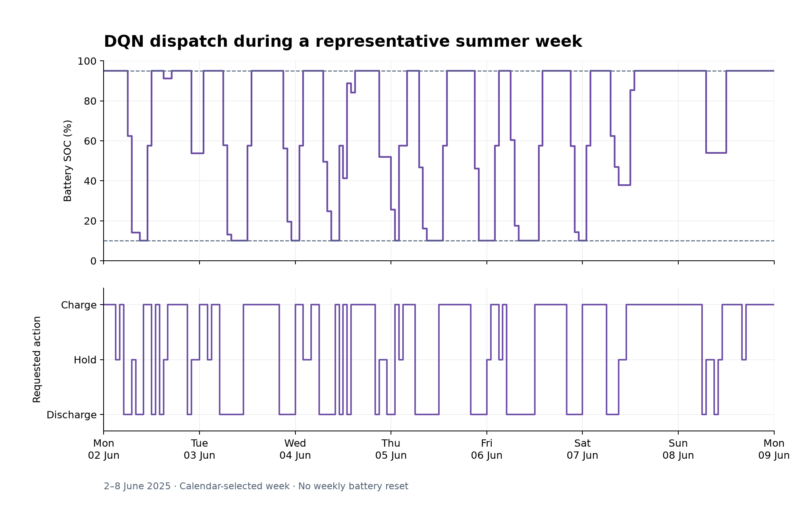
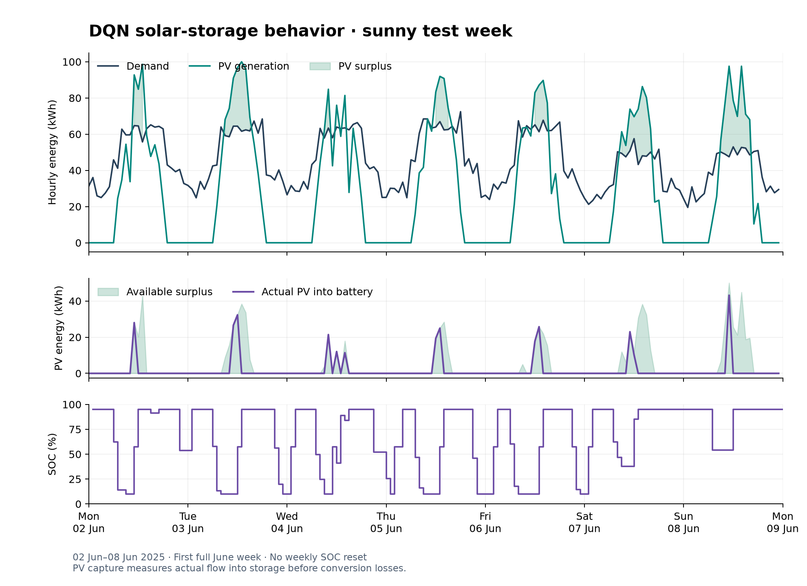
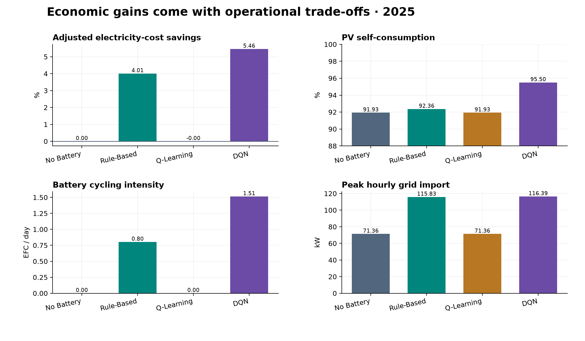
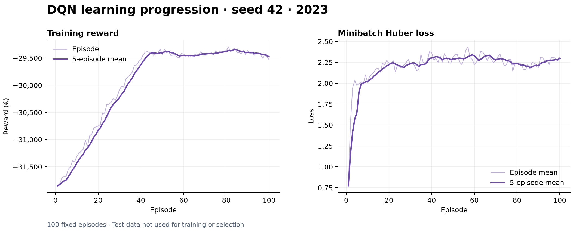
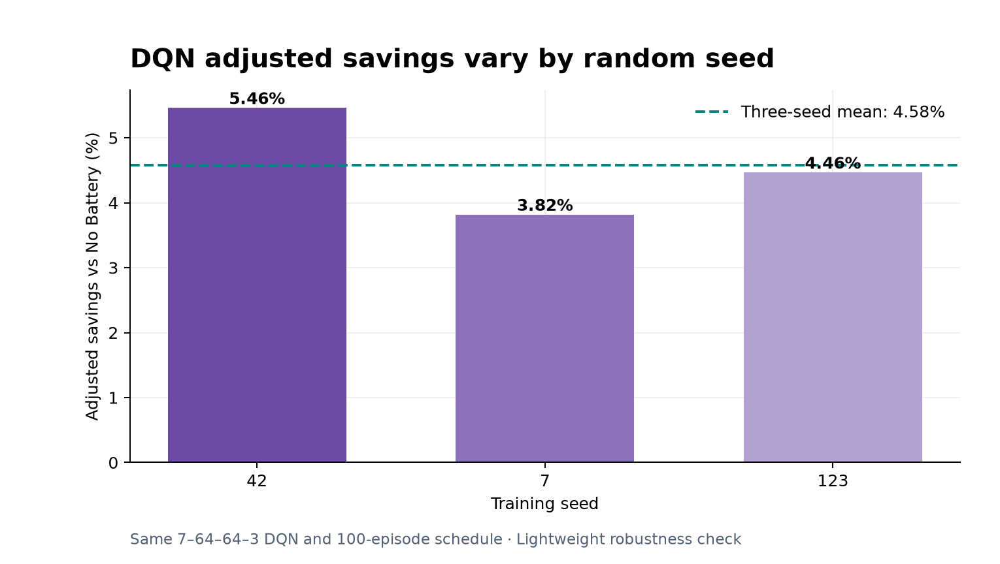

# Smart Energy Storage Optimization with Reinforcement Learning

Applied AI for cost-aware battery dispatch in a commercial/light-industrial
energy system.

## Business Problem

A facility combines hourly electricity demand, 100 kWp rooftop PV, a 100 kWh
battery and dynamic electricity prices. Each controller decides whether to
discharge, hold or charge. The goal is to reduce grid-purchasing cost while
measuring renewable self-consumption, battery cycling and peak-import trade-offs.

## Why This Project Matters

Battery dispatch links an economic objective to physical constraints. A policy
that cuts the energy bill can still buy more grid energy, accelerate battery
cycling or create a higher demand peak. This project compares simple rules with
two reinforcement-learning approaches and reports those conflicts directly.

## System Architecture



## Dataset

The reproducible synthetic dataset covers 2023–2025 at hourly resolution. It
models commercial demand, PV generation and dynamic prices. Full calendar years
provide seasonal coverage: 2023 trains the agents and fits every threshold or
normalizer, 2024 validates, and 2025 is the frozen final test. The data does not
represent a real customer, HEnEx settlement record or engineered PV site.

## Reinforcement-Learning Formulation

The continuous environment state contains demand, PV, electricity price, SOC
fraction, sine/cosine hour and weekend flag. Actions are discharge, hold and
charge. The unchanged reward is:

```text
reward = -(grid electricity cost + €0.01/kWh battery-throughput penalty)
```

Discharge cannot exceed residual load; export is disabled. PV serves demand
before storage, while a charge command can draw its remaining energy from grid.
Raw cost and a separate training-price terminal-SOC-adjusted cost are reported.

## Models and Strategies

1. **No Battery** establishes direct PV use and grid cost.
2. **Rule-Based** charges on surplus/low prices and discharges on high prices.
3. **Tabular Q-Learning** maps observations into 384 discrete states.
4. **Vanilla DQN** approximates three Q-values from seven normalized continuous inputs using a small PyTorch network, replay buffer and target network.

## Final Results — Seed 42

| Strategy | Adjusted cost (€) | Savings (€) | Savings (%) | PV self-use (%) | PV surplus captured (%) | EFC/day | Peak import (kW) |
| --- | --- | --- | --- | --- | --- | --- | --- |
| No Battery | 29,881.607 | 0.000 | 0.000 | 91.926 | 0.000 | 0.000 | 71.364 |
| Rule-Based | 28,684.041 | 1,197.566 | 4.008 | 92.358 | 5.346 | 0.803 | 115.833 |
| Q-Learning | 29,881.667 | -0.060 | -0.000 | 91.926 | 0.000 | 0.001 | 71.364 |
| DQN | 28,250.404 | 1,631.203 | 5.459 | 95.498 | 44.238 | 1.514 | 116.395 |

Seed-42 DQN produces about **5.46% adjusted
savings**, or **EUR 1,631 simulated annual
savings**, captures **44.24% of PV surplus**, and
raises PV self-consumption to **95.50%**. It also
cycles at **1.51 EFC/day** and reaches a **116.4
kW** peak.

## Key Finding

The DQN achieved the strongest electricity-cost result and substantially
improved PV utilization, while tabular Q-Learning failed to learn a useful
charging policy. The DQN also increased battery cycling and peak grid demand,
showing that economic optimization and operational efficiency are not identical
objectives.

## Robustness Check

The final DQN configuration was repeated with seeds 7 and 123; seed 42 was
reused. No best seed was selected.

| seed | Adjusted cost (€) | Savings (€) | Savings (%) | PV self-use (%) | Surplus captured (%) | EFC/day | Peak (kW) |
| --- | --- | --- | --- | --- | --- | --- | --- |
| 42 | 28,250.404 | 1,631.203 | 5.459 | 95.498 | 44.238 | 1.514 | 116.395 |
| 7 | 28,741.318 | 1,140.289 | 3.816 | 94.186 | 27.989 | 0.748 | 121.027 |
| 123 | 28,547.788 | 1,333.819 | 4.464 | 94.040 | 26.183 | 0.989 | 117.059 |

Adjusted savings average **4.58%** with a **0.83
percentage-point** sample standard deviation and range from **3.82%
to 5.46%**. This is a lightweight sensitivity check, not statistical
proof. See [the final interpretation](docs/final_results_and_business_interpretation.md).

## Visual Results

### Energy profile and PV surplus



### Cumulative purchasing cost



### DQN dispatch



### Solar-storage behavior



### Business KPIs



### Training diagnostics and seed sensitivity





## Repository Structure

```text
Smart_Energy_Storage_RL/
├── config/                 # Battery assumptions
├── data/processed/         # Active synthetic 2023–2025 dataset
├── docs/                   # Methods, stage reports and business interpretation
├── notebooks/              # Exploratory analysis
├── outputs/
│   ├── models/             # Q-table, DQN weights, normalizer and seed runs
│   ├── results/            # Hourly outputs, metrics and robustness table
│   ├── portfolio_figures/  # Curated GitHub visuals
│   └── archive/            # Preservation manifests and legacy evidence
├── src/                    # Data, environment, agents, training and evaluation
├── tests/                  # Unit, integration and reproducibility checks
├── README.md
└── requirements.txt
```

## How to Run

Python 3.11 or 3.12 is recommended.

```bash
python -m venv .venv
# Windows: .venv\Scripts\activate
# macOS/Linux: source .venv/bin/activate
python -m pip install --upgrade pip
python -m pip install -r requirements.txt

python -m src.data.generate_synthetic_energy_data
python -m unittest discover -s tests -v
python -m src.evaluation.compare_baselines
python -m src.training.train_q_learning
python -m src.evaluation.evaluate_q_learning
python -m src.training.train_dqn
python -m src.evaluation.evaluate_dqn
```

The repository already contains completed scientific artifacts. Training
commands protect completed models from accidental overwrite. To reproduce the
robustness outputs in an isolated copy:

```bash
python -m src.training.train_dqn_seed --seed 7
python -m src.training.train_dqn_seed --seed 123
python -m src.evaluation.dqn_robustness
python -m src.evaluation.final_portfolio
```

## Testing

The final suite contains **59 tests**, covering chronology, physics, energy
balance, terminal valuation, Q-Learning, DQN replay/targets, frozen inference,
serialization and robustness aggregation. All pass.

## Limitations

- Synthetic data and one facility/battery configuration.
- Simplified battery model without electrochemical degradation or temperature.
- No demand-charge tariff, export revenue or probabilistic forecast.
- Current-hour observations are known before action.
- Discrete full-rate actions can create boundary-limited commands.
- One fixed DQN configuration and only three random seeds.
- Savings exclude capex and cannot be treated as investment return.

## Future Work

Add explicit degradation and peak-demand costs, test export/dynamic tariffs,
replace synthetic inputs with HEnEx/PVGIS or customer data, and consider
continuous control only when the business case justifies added complexity.

## Tech Stack

Python, Pandas, NumPy, PyTorch, Matplotlib and the standard-library `unittest`
framework.

## Project Status

Stages 1–6 are complete. The project is prepared for GitHub review; no Git
repository was initialized and nothing was pushed. See
[`docs/PROJECT_STATE.md`](docs/PROJECT_STATE.md) for the compact scientific
checkpoint and [`docs/github_preparation.md`](docs/github_preparation.md) for
suggested repository metadata.
